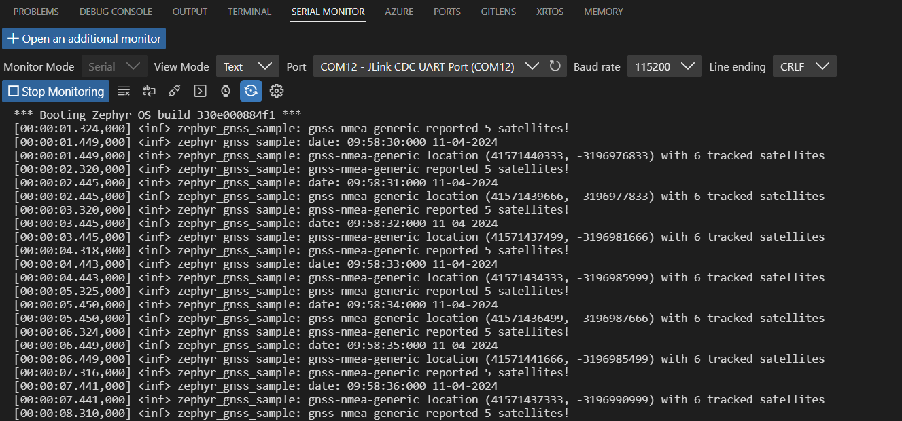
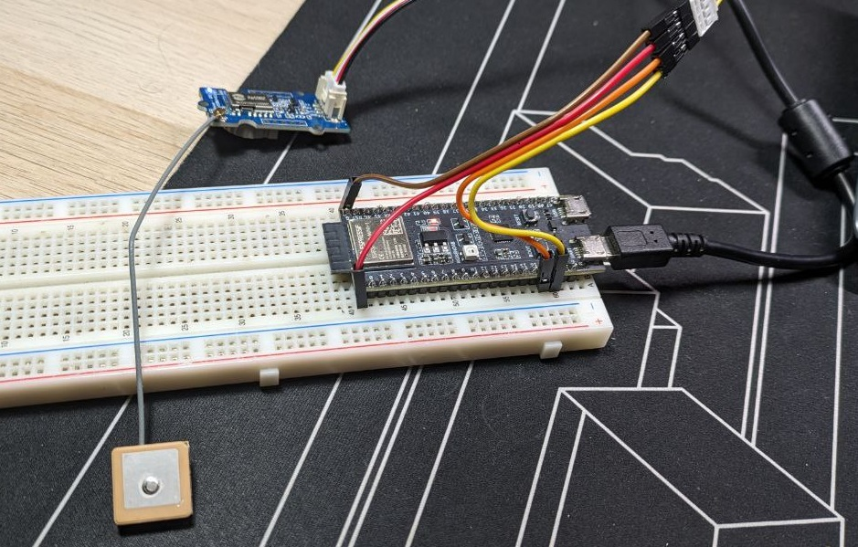
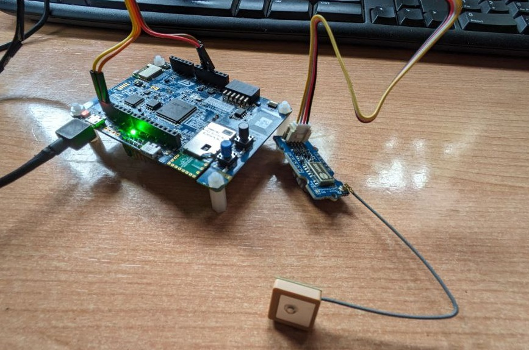

# Zephyr GNSS sample
Welcome to the GNSS sample project to show how to configure and use any [NMEA0183](https://en.wikipedia.org/wiki/NMEA_0183) device with [Zephyr RTOS](https://www.zephyrproject.org/) trhough the GNSS API in different boards.

**I encourage you to add the corresponding overlays to support your boards!**

## Setting Up Your Zephyr RTOS Environment

### 1. Install Dependencies:

Ensure you have the following dependencies installed on your system:

- [Git](https://git-scm.com/)
- [CMake](https://cmake.org/)
- [Ninja](https://ninja-build.org/)
- [python](https://www.python.org/)
- [devicetree compiler](https://www.devicetree.org/)
- Toolchain appropriate for your target architecture (see Install Zephyr SDK section)

Follow the [Zephyr documentation](https://docs.zephyrproject.org/latest/getting_started) for detailed instructions based on your operating system.

### 2. Clone the Zephyr Repository:

Open your terminal and run the following command:

```bash
git clone https://github.com/zephyrproject-rtos/zephyr.git
```

check out the branch into **version 3.6** to get a stable Zephyr version instead of developing directly into main:
```bash
git checkout v3.6-branch
```

### 3. Install Zephyr SDK:

The Zephyr SDK can be downloaded from the [official Zephyr repository](https://github.com/zephyrproject-rtos/sdk-ng/tags). Download the **v0.16.4** version which is the suitable SDK for Zephyr 3.6 release.

### 4. Set Up Environment Variables:

Add the Zephyr binary directory to your PATH and set the `ZEPHYR_BASE` variable. For example:

```bash
export ZEPHYR_SDK_INSTALL_DIR=<path_to_sdk>
source <path_to_zephyr>/zephyr-env.sh
```

### 5. Choose a Board:

Navigate to your project directory and run:

```bash
west init -m https://github.com/zephyrproject-rtos/zephyr
west update
```

## GNSS Zephyr overview
The GNSS API was released in Zephyr version v3.6.0. The GNSS API is built upon the modem service, which provides modules necessary to communicate with modems. The GNSS subsystem covers everything from sending and receiving commands to and from the modem, to parsing, creating and processing NMEA0183 messages.

The source code can be found under the path `zephyr/drivers/gnss`, which is divided into specific GNSS module drivers with custom features such as power management, some files with utils and a generic NMEA0183 driver.

A brief overview of the main files:
- **gnss_dump**: it is a set of utilities to get, convert and print GNSS information into readable and useful data.
- **gnss_nmea0183** and **gnss_parse**: NMEA0183 utilities such as checksum calculation, parsing a ddmm.mmmm formatted angle to nano degrees or parsing GGA, RMC and GSV NMEA messages.
- **gnss_nmea0183_match**: This code is based on “modem_chat” match handlers, a Zephyr utility to process messages from modems. The callbacks to parse GGA, RMC and GSV messages are defined here.

Zephyr has created a generic NMEA driver which can be used for any NMEA talker. As any other driver, it is instantiated by the `DEVICE_DT_INST_DEFINE` macro and as GNSS driver, it includes the following code to call the callbacks defined in the `gnss_nmea0183_match.c` for corresponding NMEA identifier:

```c
MODEM_CHAT_MATCHES_DEFINE(unsol_matches,
	MODEM_CHAT_MATCH_WILDCARD("$??GGA,", ",*", gnss_nmea0183_match_gga_callback),
	MODEM_CHAT_MATCH_WILDCARD("$??RMC,", ",*", gnss_nmea0183_match_rmc_callback),
#if CONFIG_GNSS_SATELLITES
	MODEM_CHAT_MATCH_WILDCARD("$??GSV,", ",*", gnss_nmea0183_match_gsv_callback),
#endif
);
```

This repository uses the **generic NMEA driver**. Thus, it can be used with any GNNS module that prints NMEA sentences into UART. In order to use the generic NMEA driver you just need to add the proper device tree overlay to configure the UART of the board to read the NMEA sentences. This project show some examples for different boards.

Expected output:


## Tested boards
The already tested boards are: esp32s3-mini-1 and b_l4s5i_iot01a.
### esp32s3-mini-1


**Connexion pins:**

|esp32 | GNSS module|
|---|---|
|3.3V | VCC|
|GND  |GND|
|pin 17 |RX|
|pin 18 |TX|

### b_l4s5i_iot01a


**Connexion pins:**
|b_l4s5 | GNSS module|
|---|---|
|3.3V | VCC|
|GND  |GND|
|pin D1 |RX|
|pin D0 |TX|

## Build & flash
Choose your board by running:

```bash
west build -b <your_board>
```

The following commands corresponds to each of the tested boards:

```bash
west build -b b_l4s5i_iot01a
west build -b esp32s3_devkitm
```

Then, flash Flash it with:

```bash
west flash
```

# Contribute
I believe that the fusion of NMEA 0183 with Zephyr provides an incredible possibilities. I encourage you to check it out with your boards and NMEA GNSS module following the steps of this readme. If you have any question don't hesitate to write an **issue** and if you have successed with your board, open a **pull request** to integrate your overlay!